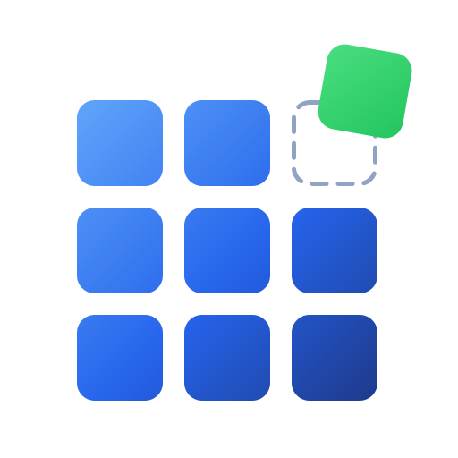
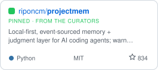
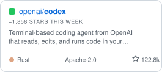
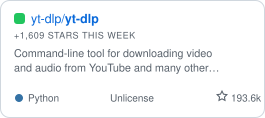
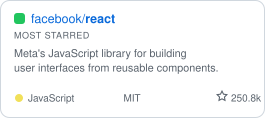
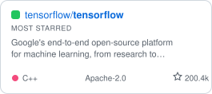
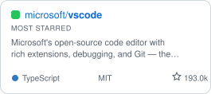

<!-- GENERATED FILE — do not edit README.md directly. -->
<!-- Edit data/tools.json and run scripts/build_readme.py (CI does this nightly). -->

# OSSDrop

**Drop your open-source tool.**
Discover, share, and discuss open-source software — a curated home for the
tools developers actually use.

    

[AI & Coding Agents](#-ai--coding-agents) · [Developer Tools & CLI](#-developer-tools--cli) · [Web & APIs](#-web--apis) · [Data & Databases](#-data--databases) · [DevOps & Self-Hosted](#-devops--self-hosted) · [Files & Sync](#-files--sync) · [Security & Privacy](#-security--privacy) · [Productivity](#-productivity) · [Notes & Knowledge](#-notes--knowledge) · [Communication & Social](#-communication--social) · [Automation & IoT](#-automation--iot) · [Finance & Business](#-finance--business) · [Science & Education](#-science--education) · [Creator / Media](#-creator--media)

## What is OSSDrop?

**OSSDrop is a curated home for open-source tools** — a community-maintained
place to discover, share, and discuss developer tools, self-hosted apps, and
libraries. Makers drop their own project with a single pull request. Every entry
is a real open-source project: public repository, OSI license, honest one-line
description. Star counts, icons, and trending update automatically, and no
placement on this list is paid.

Browse by category below, explore the same tools ranked at
[ossdrop.com](https://ossdrop.com), discuss on
[r/OSSDrop](https://www.reddit.com/r/OSSDrop/), or [drop your tool](CONTRIBUTING.md)
— it takes one PR and it's free.

## Trending this week

The biggest star gains among listed tools in the last 7 days — measured, not editorialized.

<a href="https://github.com/riponcm/projectmem"><picture><source media="(prefers-color-scheme: dark)" srcset="assets/cards/riponcm-projectmem-dark.svg"></picture></a>&nbsp;<a href="https://github.com/openai/codex"><picture><source media="(prefers-color-scheme: dark)" srcset="assets/cards/openai-codex-dark.svg"></picture></a>&nbsp;<a href="https://github.com/yt-dlp/yt-dlp"><picture><source media="(prefers-color-scheme: dark)" srcset="assets/cards/yt-dlp-yt-dlp-dark.svg"></picture></a>

## Most starred

The heaviest hitters on the list — recomputed nightly.

<a href="https://github.com/facebook/react"><picture><source media="(prefers-color-scheme: dark)" srcset="assets/cards/facebook-react-dark.svg"></picture></a>&nbsp;<a href="https://github.com/tensorflow/tensorflow"><picture><source media="(prefers-color-scheme: dark)" srcset="assets/cards/tensorflow-tensorflow-dark.svg"></picture></a>&nbsp;<a href="https://github.com/microsoft/vscode"><picture><source media="(prefers-color-scheme: dark)" srcset="assets/cards/microsoft-vscode-dark.svg"></picture></a>

##  AI & Coding Agents

| Tool | What it is | License | Stars | Links |
| --- | --- | --- | --- | --- |
|  **[Ollama](https://ollama.com)** | Run open large language models locally with a simple CLI and API — pull a model and start chatting or building. |  |  | [code](https://github.com/ollama/ollama) |
|  **[Transformers](https://huggingface.co/docs/transformers)** | Hugging Face's library of pretrained models for text, vision, and audio — the standard toolkit for transformer models. |  |  | [code](https://github.com/huggingface/transformers) |
|  **[Codex CLI](https://github.com/openai/codex)** | Terminal-based coding agent from OpenAI that reads, edits, and runs code in your local repository. |  |  | [code](https://github.com/openai/codex) |
|  **[OpenHands](https://openhands.dev)** | AI agent platform that writes code, runs shell commands, and browses the web to complete software engineering tasks. |  |  | [code](https://github.com/OpenHands/OpenHands) |
|  **[MetaGPT](https://atoms.dev/)** | Multi-agent framework that simulates a software company's roles to turn one-line requirements into code. |  |  | [code](https://github.com/FoundationAgents/MetaGPT) |
|  **[Open Interpreter](http://openinterpreter.com/)** | Terminal coding agent that lets open models such as DeepSeek, Kimi, and Qwen read, write, and run code. |  |  | [code](https://github.com/openinterpreter/openinterpreter) |
|  **[Cline](https://cline.bot)** | Autonomous coding agent for VS Code that can create and edit files, run terminal commands, and use a browser. |  |  | [code](https://github.com/cline/cline) |
|  **[crewAI](https://crewai.com)** | Framework for orchestrating role-based, collaborative multi-agent workflows, built independent of LangChain. |  |  | [code](https://github.com/crewAIInc/crewAI) |
|  **[Goose](https://goose-docs.ai/)** | Extensible AI agent that can install, execute, edit, and test code locally with any LLM backend. |  |  | [code](https://github.com/aaif-goose/goose) |
|  **[Grok-1](https://x.ai)** | Open-weights release of xAI's 314B-parameter Grok-1 large language model, with JAX example code. |  |  | [code](https://github.com/xai-org/grok-1) |
|  **[Aider](https://aider.chat)** | AI pair programming in your terminal; edits files in your local git repo and commits as it goes. |  |  | [code](https://github.com/Aider-AI/aider) · [docs](https://aider.chat/docs/) |
|  **[LangGraph](https://docs.langchain.com/oss/python/langgraph/)** | Low-level framework from the LangChain team for building stateful, multi-step AI agents as graphs. |  |  | [code](https://github.com/langchain-ai/langgraph) |
|  **[Continue](https://continue.dev)** | Open-source AI coding assistant for VS Code and JetBrains that works with the models you choose. |  |  | [code](https://github.com/continuedev/continue) |
|  **[Tabby](https://tabbyml.com)** | Self-hosted AI coding assistant with code completion and chat, an alternative to GitHub Copilot. |  |  | [code](https://github.com/TabbyML/tabby) |
|  **[Gemma](https://ai.google.dev/gemma)** | Google DeepMind's open-weight LLM library, with JAX tooling to run and fine-tune the Gemma models. |  |  | [code](https://github.com/google-deepmind/gemma) |
|  **[RecurrentGemma](https://github.com/google-deepmind/recurrentgemma)** | Google DeepMind's open-weight language model based on the Griffin architecture for fast, memory-efficient inference. |  |  | [code](https://github.com/google-deepmind/recurrentgemma) |
|  **[projectmem](https://projectmem.dev)** | Local-first, event-sourced memory + judgment layer for AI coding agents; warns before repeating a failed fix. |  |  | [code](https://github.com/riponcm/projectmem) · [paper](https://arxiv.org/abs/2606.12329) |

##  Developer Tools & CLI

| Tool | What it is | License | Stars | Links |
| --- | --- | --- | --- | --- |
|  **[VS Code](https://code.visualstudio.com)** | Microsoft's open-source code editor with rich extensions, debugging, and Git — the core of Visual Studio Code. |  |  | [code](https://github.com/microsoft/vscode) |
|  **[Go](https://go.dev)** | Google's open-source programming language for building simple, reliable, and efficient software. |  |  | [code](https://github.com/golang/go) |
|  **[Neovim](https://neovim.io)** | Hyperextensible, Vim-based text editor with a built-in language server client and Lua scripting. |  |  | [code](https://github.com/neovim/neovim) |
|  **[Playwright](https://playwright.dev)** | Microsoft's framework for reliable end-to-end browser testing across Chromium, Firefox, and WebKit. |  |  | [code](https://github.com/microsoft/playwright) |
|  **[MCP Servers](https://modelcontextprotocol.io)** | Reference server implementations for the Model Context Protocol, the open standard connecting AI assistants to tools and data. |  |  | [code](https://github.com/modelcontextprotocol/servers) |
|  **[Zed](https://zed.dev)** | High-performance, multiplayer code editor written in Rust, from the creators of Atom and Tree-sitter. |  |  | [code](https://github.com/zed-industries/zed) |
|  **[fzf](https://junegunn.github.io/fzf/)** | General-purpose command-line fuzzy finder for files, history, and processes; integrates with the shell and Vim. |  |  | [code](https://github.com/junegunn/fzf) |
|  **[lazygit](https://github.com/jesseduffield/lazygit)** | Simple terminal UI for Git commands. |  |  | [code](https://github.com/jesseduffield/lazygit) |
|  **[act](https://nektosact.com)** | Runs GitHub Actions workflows locally in Docker, for testing CI before pushing. |  |  | [code](https://github.com/nektos/act) |
|  **[ripgrep](https://github.com/BurntSushi/ripgrep)** | Fast recursive regex search over directories that respects your .gitignore. |  |  | [code](https://github.com/BurntSushi/ripgrep) |
|  **[bat](https://github.com/sharkdp/bat)** | A cat clone with syntax highlighting and Git integration. |  |  | [code](https://github.com/sharkdp/bat) |
|  **[Starship](https://starship.rs)** | Fast, customizable command-line prompt for any shell — shows git status, versions, and context at a glance. |  |  | [code](https://github.com/starship/starship) |
|  **[lazydocker](https://github.com/jesseduffield/lazydocker)** | A terminal UI for managing Docker containers, images, and volumes. |  |  | [code](https://github.com/jesseduffield/lazydocker) |
|  **[Helix](https://helix-editor.com)** | A modal terminal text editor with built-in LSP support, in the tradition of Vim and Kakoune. |  |  | [code](https://github.com/helix-editor/helix) |
|  **[fd](https://github.com/sharkdp/fd)** | A simple, user-friendly alternative to the Unix find command for searching files. |  |  | [code](https://github.com/sharkdp/fd) |
|  **[zoxide](https://crates.io/crates/zoxide)** | A smarter cd command that learns your most-used directories, for faster navigation. |  |  | [code](https://github.com/ajeetdsouza/zoxide) |
|  **[k9s](https://k9scli.io)** | A terminal UI for interacting with and managing Kubernetes clusters. |  |  | [code](https://github.com/derailed/k9s) |
|  **[delta](https://dandavison.github.io/delta/)** | A syntax-highlighting pager for git, diff, grep, and blame output. |  |  | [code](https://github.com/dandavison/delta) |
|  **[Atuin](https://atuin.sh)** | Replaces default shell history with a searchable database that can sync across machines. |  |  | [code](https://github.com/atuinsh/atuin) |
|  **[hyperfine](https://github.com/sharkdp/hyperfine)** | A command-line benchmarking tool for comparing the runtime of commands. |  |  | [code](https://github.com/sharkdp/hyperfine) |

##  Web & APIs

| Tool | What it is | License | Stars | Links |
| --- | --- | --- | --- | --- |
|  **[React](https://react.dev)** | Meta's JavaScript library for building user interfaces from reusable components. |  |  | [code](https://github.com/facebook/react) |
|  **[Flutter](https://flutter.dev)** | Google's UI toolkit for building natively compiled apps for mobile, web, and desktop from one codebase. |  |  | [code](https://github.com/flutter/flutter) |
|  **[Next.js](https://nextjs.org)** | Vercel's React framework for production — full-stack rendering, routing, and built-in optimizations. |  |  | [code](https://github.com/vercel/next.js) |
|  **[Supabase](https://supabase.com)** | Open-source Firebase alternative: a Postgres database with auth, storage, realtime, and auto-generated APIs. |  |  | [code](https://github.com/supabase/supabase) |
|  **[FastAPI](https://fastapi.tiangolo.com/)** | Modern, high-performance Python web framework for building APIs, with automatic docs and type validation. |  |  | [code](https://github.com/fastapi/fastapi) |
|  **[Bun](https://bun.sh)** | Fast all-in-one JavaScript runtime, bundler, test runner, and package manager, built as a drop-in for Node. |  |  | [code](https://github.com/oven-sh/bun) |
|  **[Gin](https://gin-gonic.com/)** | HTTP web framework for Go, built on httprouter, used for REST APIs and microservices. |  |  | [code](https://github.com/gin-gonic/gin) |
|  **[Hoppscotch](https://hoppscotch.io)** | API development environment in the browser: REST, GraphQL, and realtime clients; self-hostable. |  |  | [code](https://github.com/hoppscotch/hoppscotch) · [docs](https://docs.hoppscotch.io) |
|  **[NestJS](https://nestjs.com)** | Node.js framework for server-side applications in TypeScript, using Angular-style modules and dependency injection. |  |  | [code](https://github.com/nestjs/nest) |
|  **[JSON Server](https://github.com/typicode/json-server)** | Spins up a fake REST API with CRUD endpoints from a JSON file, for prototyping frontends without a backend. |  |  | [code](https://github.com/typicode/json-server) |
|  **[Express](https://expressjs.com)** | Minimalist web framework for Node.js, used to build HTTP servers and APIs. |  |  | [code](https://github.com/expressjs/express) |
|  **[Traefik](https://traefik.io)** | Reverse proxy and load balancer for microservices, with automatic service discovery and HTTPS via Let's Encrypt. |  |  | [code](https://github.com/traefik/traefik) |
|  **[Kong Gateway](https://konghq.com/install/)** | API gateway that manages, secures, and routes traffic between clients and backend or microservice APIs. |  |  | [code](https://github.com/Kong/kong) |
|  **[Insomnia](https://insomnia.rest)** | Desktop API client for testing REST, GraphQL, WebSocket, SSE, and gRPC requests, an alternative to Postman. |  |  | [code](https://github.com/Kong/insomnia) |
|  **[HTTPie](https://httpie.io)** | User-friendly command-line HTTP client with JSON support and syntax highlighting. |  |  | [code](https://github.com/httpie/cli) · [docs](https://httpie.io/docs/cli) |
|  **[Fastify](https://www.fastify.dev)** | Web framework for Node.js focused on low overhead and JSON schema-based request/response handling. |  |  | [code](https://github.com/fastify/fastify) |

##  Data & Databases

| Tool | What it is | License | Stars | Links |
| --- | --- | --- | --- | --- |
|  **[Apache Superset](https://superset.apache.org/)** | Data exploration and visualization platform for building dashboards and charts on existing databases. |  |  | [code](https://github.com/apache/superset) |
|  **[Meilisearch](https://www.meilisearch.com)** | Fast, typo-tolerant search engine with a simple API. | -22C55E?style=flat-square) |  | [code](https://github.com/meilisearch/meilisearch) · [docs](https://www.meilisearch.com/docs) |
|  **[etcd](https://etcd.io)** | Distributed key-value store used for shared configuration and service discovery, notably within Kubernetes. |  |  | [code](https://github.com/etcd-io/etcd) |
|  **[ClickHouse](https://clickhouse.com)** | Column-oriented database management system for real-time analytics over very large datasets. |  |  | [code](https://github.com/ClickHouse/ClickHouse) |
|  **[Apache Airflow](https://airflow.apache.org/)** | Platform to author, schedule, and monitor data pipelines as directed acyclic graphs (DAGs). |  |  | [code](https://github.com/apache/airflow) |
|  **[Milvus](https://milvus.io)** | Vector database for storing and searching embeddings, used for similarity search in AI applications. |  |  | [code](https://github.com/milvus-io/milvus) |
|  **[TiDB](https://www.tidb.io/)** | Distributed SQL database that is MySQL-compatible, supporting both transactional and analytical workloads. |  |  | [code](https://github.com/pingcap/tidb) |
|  **[DuckDB](https://duckdb.org)** | In-process analytical SQL database; runs OLAP queries inside your app or notebook. |  |  | [code](https://github.com/duckdb/duckdb) · [docs](https://duckdb.org/docs/) |
|  **[Qdrant](https://qdrant.tech)** | High-performance vector database and search engine for embeddings — powers semantic search and RAG. |  |  | [code](https://github.com/qdrant/qdrant) |
|  **[RocksDB](http://rocksdb.org)** | Embeddable, persistent key-value store library optimized for fast storage; used as a storage engine in other databases. |  |  | [code](https://github.com/facebook/rocksdb) |
|  **[Redash](http://redash.io/)** | Connects to SQL and NoSQL data sources to build queries, visualizations, and dashboards. |  |  | [code](https://github.com/getredash/redash) |
|  **[PostgREST](https://postgrest.org)** | Turns an existing PostgreSQL database directly into a RESTful API, generated from the schema. |  |  | [code](https://github.com/PostgREST/postgrest) |
|  **[Valkey](https://valkey.io)** | High-performance in-memory key-value data store; a community-driven fork of Redis under an open license. |  |  | [code](https://github.com/valkey-io/valkey) |
|  **[Vitess](http://vitess.io)** | Database clustering system that shards and scales MySQL horizontally; originally built at YouTube. |  |  | [code](https://github.com/vitessio/vitess) |

##  DevOps & Self-Hosted

| Tool | What it is | License | Stars | Links |
| --- | --- | --- | --- | --- |
|  **[Kubernetes](https://kubernetes.io)** | Production-grade container orchestration to automate deployment, scaling, and management of containerized apps. |  |  | [code](https://github.com/kubernetes/kubernetes) |
|  **[Immich](https://immich.app)** | Self-hosted photo and video backup and management solution, an alternative to Google Photos. |  |  | [code](https://github.com/immich-app/immich) |
|  **[Uptime Kuma](https://uptime.kuma.pet)** | Self-hosted uptime monitoring tool with status pages and notifications. |  |  | [code](https://github.com/louislam/uptime-kuma) |
|  **[Grafana](https://grafana.com)** | Open observability platform to query, visualize, and alert on metrics, logs, and traces. |  |  | [code](https://github.com/grafana/grafana) |
|  **[Caddy](https://caddyserver.com)** | Web server and reverse proxy with automatic HTTPS by default, configured in a simple, readable file. |  |  | [code](https://github.com/caddyserver/caddy) |
|  **[Ansible](https://www.ansible.com/)** | Agentless IT automation tool for configuration management, application deployment, and orchestration over SSH. |  |  | [code](https://github.com/ansible/ansible) |
|  **[Prometheus](https://prometheus.io/)** | Monitoring system and time-series database with a query language and alerting. |  |  | [code](https://github.com/prometheus/prometheus) |
|  **[Coolify](https://coolify.io)** | Self-hostable platform to deploy apps, databases, and static sites; an open alternative to Heroku and Netlify. |  |  | [code](https://github.com/coollabsio/coolify) |
|  **[Gitea](https://gitea.com)** | Self-hosted Git service with code review, package registry, and CI/CD, similar to GitHub or GitLab. |  |  | [code](https://github.com/go-gitea/gitea) |
|  **[Headscale](https://github.com/juanfont/headscale)** | Self-hosted, open-source implementation of the Tailscale control server. |  |  | [code](https://github.com/juanfont/headscale) |
|  **[Portainer](https://www.portainer.io)** | Web UI to manage Docker, Swarm, and Kubernetes — deploy, monitor, and control containers from a browser. |  |  | [code](https://github.com/portainer/portainer) |
|  **[AdGuard Home](https://adguard.com/adguard-home/overview.html)** | Network-wide DNS server that blocks ads and trackers for every device on a network. |  |  | [code](https://github.com/AdguardTeam/AdGuardHome) |
|  **[restic](https://restic.net)** | Command-line backup program that encrypts and deduplicates data to local or cloud storage. |  |  | [code](https://github.com/restic/restic) |
|  **[OpenTofu](https://opentofu.org)** | Infrastructure-as-code tool to provision cloud and on-prem resources declaratively; community-driven fork of Terraform. |  |  | [code](https://github.com/opentofu/opentofu) |
|  **[Authelia](https://www.authelia.com)** | Self-hosted single sign-on and multi-factor authentication portal that sits in front of reverse proxies. |  |  | [code](https://github.com/authelia/authelia) |
|  **[Jenkins](https://www.jenkins.io)** | Self-hosted automation server for building, testing, and deploying software through CI/CD pipelines. |  |  | [code](https://github.com/jenkinsci/jenkins) |
|  **[OpenSRE](https://opensre.in)** | Self-hosted AI SRE for incident investigation with episodic memory, a knowledge graph, Web UI, Slack, and Teams. |  |  | [code](https://github.com/swapnildahiphale/OpenSRE) · [docs](https://opensre.in/docs) |

##  Files & Sync

| Tool | What it is | License | Stars | Links |
| --- | --- | --- | --- | --- |
|  **[Syncthing](https://syncthing.net)** | Continuous, peer-to-peer file synchronization between your devices — private, encrypted, no cloud required. |  |  | [code](https://github.com/syncthing/syncthing) |
|  **[LocalSend](https://localsend.org)** | Cross-platform app for sending files between devices on the same local network, an alternative to AirDrop. |  |  | [code](https://github.com/localsend/localsend) |
|  **[rclone](https://rclone.org)** | Command-line program to sync, copy, and manage files across dozens of cloud storage providers. |  |  | [code](https://github.com/rclone/rclone) |
|  **[croc](https://schollz.com/software/croc6)** | Command-line tool for sending files and folders between computers over an encrypted relay connection. |  |  | [code](https://github.com/schollz/croc) |
|  **[qBittorrent](https://www.qbittorrent.org)** | BitTorrent client with a Qt-based desktop interface and a built-in web UI for remote management. |  |  | [code](https://github.com/qbittorrent/qBittorrent) |
|  **[Nextcloud Server](https://nextcloud.com)** | Self-hosted file sync and share platform with collaboration apps, an alternative to Dropbox or Google Drive. |  |  | [code](https://github.com/nextcloud/server) |
|  **[File Browser](https://filebrowser.org)** | Web-based file manager for browsing, uploading, and sharing files stored on a server, accessed through a browser. |  |  | [code](https://github.com/filebrowser/filebrowser) |
|  **[SeaweedFS](https://seaweedfs.com)** | Distributed file and object storage system with an S3-compatible API, built to handle very large numbers of files. |  |  | [code](https://github.com/seaweedfs/seaweedfs) |
|  **[Magic Wormhole](https://magic-wormhole.readthedocs.io/en/latest/)** | Sends files and short messages between two computers, paired using a one-time human-readable code. |  |  | [code](https://github.com/magic-wormhole/magic-wormhole) |
|  **[Duplicati](https://github.com/duplicati/duplicati)** | Backup client that encrypts files and uploads them to cloud storage providers such as S3, Backblaze, and Google Drive. |  |  | [code](https://github.com/duplicati/duplicati) |
|  **[Kopia](https://kopia.io)** | Cross-platform backup tool with client-side end-to-end encryption, deduplication, and a CLI plus GUI. |  |  | [code](https://github.com/kopia/kopia) |

##  Security & Privacy

| Tool | What it is | License | Stars | Links |
| --- | --- | --- | --- | --- |
|  **[Vaultwarden](https://github.com/dani-garcia/vaultwarden)** | Lightweight, self-hostable server compatible with Bitwarden clients — run your own password manager. |  |  | [code](https://github.com/dani-garcia/vaultwarden) |
|  **[Metasploit Framework](https://www.metasploit.com/)** | Penetration testing framework with exploit development and vulnerability verification tools. |  |  | [code](https://github.com/rapid7/metasploit-framework) |
|  **[Trivy](https://trivy.dev)** | Scanner for vulnerabilities, misconfigurations, and exposed secrets in containers, code, and cloud infrastructure. |  |  | [code](https://github.com/aquasecurity/trivy) |
|  **[Keycloak](https://www.keycloak.org)** | Identity and access management server with SSO, OAuth2, OpenID Connect, and user federation. |  |  | [code](https://github.com/keycloak/keycloak) |
|  **[Gitleaks](https://gitleaks.io)** | Scans git repositories and files for hardcoded secrets like API keys and passwords. |  |  | [code](https://github.com/gitleaks/gitleaks) |
|  **[KeePassXC](https://keepassxc.org)** | Cross-platform, offline password manager; community continuation of KeePass. |  |  | [code](https://github.com/keepassxreboot/keepassxc) · [docs](https://keepassxc.org/docs/) |
|  **[age](https://age-encryption.org)** | Simple file encryption tool and Go library with small explicit keys and no configuration options. |  |  | [code](https://github.com/FiloSottile/age) |
|  **[sops](https://getsops.io)** | Encrypts and decrypts values in YAML, JSON, ENV, and INI files, integrating with cloud KMS providers. |  |  | [code](https://github.com/getsops/sops) |
|  **[Wazuh](https://wazuh.com/)** | Open-source security platform combining SIEM and XDR for endpoint and cloud workload monitoring. |  |  | [code](https://github.com/wazuh/wazuh) |
|  **[Cryptomator](https://cryptomator.org)** | Client-side, password-based encryption for your cloud files, across desktop and mobile. |  |  | [code](https://github.com/cryptomator/cryptomator) |
|  **[OWASP ZAP](https://www.zaproxy.org)** | Web application security scanner for finding vulnerabilities during testing and development. |  |  | [code](https://github.com/zaproxy/zaproxy) |

##  Productivity

| Tool | What it is | License | Stars | Links |
| --- | --- | --- | --- | --- |
|  **[PowerToys](https://learn.microsoft.com/windows/powertoys/)** | Microsoft's set of power-user utilities for Windows: window management, bulk rename, color picker, and more. |  |  | [code](https://github.com/microsoft/PowerToys) |
|  **[Excalidraw](https://excalidraw.com)** | Virtual whiteboard for sketching hand-drawn-style diagrams and wireframes, with live collaboration. |  |  | [code](https://github.com/excalidraw/excalidraw) |
|  **[AppFlowy](https://appflowy.io)** | Open-source Notion alternative for notes, docs, and project boards — local-first and self-hostable. |  |  | [code](https://github.com/AppFlowy-IO/AppFlowy) |
|  **[Rectangle](https://rectangleapp.com)** | Move and resize macOS windows with keyboard shortcuts and drag-to-snap areas. |  |  | [code](https://github.com/rxhanson/Rectangle) |
|  **[Super Productivity](http://super-productivity.com?ref=github)** | Todo list app with built-in time tracking and Jira/GitLab/GitHub integrations. |  |  | [code](https://github.com/super-productivity/super-productivity) |
|  **[Wekan](https://wekan.fi)** | Self-hosted kanban board application, an alternative to Trello. |  |  | [code](https://github.com/wekan/wekan) |
|  **[Linkwarden](https://linkwarden.app)** | Self-hosted bookmark manager for collecting, annotating, and archiving links. |  |  | [code](https://github.com/linkwarden/linkwarden) |
|  **[ActivityWatch](https://activitywatch.net/)** | Cross-platform automatic time tracker that logs app and website usage locally. |  |  | [code](https://github.com/ActivityWatch/activitywatch) |
|  **[Etherpad](https://etherpad.org)** | Real-time collaborative plain-text and rich-text document editor. |  |  | [code](https://github.com/ether/etherpad) |
|  **[FreshRSS](https://freshrss.org)** | Self-hostable RSS and Atom feed aggregator. |  |  | [code](https://github.com/FreshRSS/FreshRSS) |
|  **[Espanso](https://espanso.org)** | Cross-platform text expander for snippets and templates, written in Rust. |  |  | [code](https://github.com/espanso/espanso) |
|  **[GemType](https://gemtype.matily.org)** | Free, open-source Grammarly alternative: AI grammar and rewrite for Chrome and Safari. |  |  | [code](https://github.com/riponcm/GemType) |
|  **[AI Dictation](https://aidictation.com)** | Cross-platform speech-to-text app for voice typing with offline recognition and optional text cleanup. |  |  | [code](https://github.com/writingmate/aidictation) |

##  Notes & Knowledge

| Tool | What it is | License | Stars | Links |
| --- | --- | --- | --- | --- |
|  **[Memos](https://usememos.com)** | Self-hosted, lightweight note-taking service built for quick capture, with Markdown support. |  |  | [code](https://github.com/usememos/memos) |
|  **[Joplin](https://joplinapp.org)** | Privacy-focused, open-source note-taking and to-do app with end-to-end encrypted sync across devices. |  |  | [code](https://github.com/laurent22/joplin) |
|  **[SiYuan](https://b3log.org/siyuan)** | Self-hosted personal knowledge management app with block-based editing and Markdown/WYSIWYG support. |  |  | [code](https://github.com/siyuan-note/siyuan) |
|  **[Logseq](https://logseq.com)** | Privacy-first, local-first knowledge base for networked notes and outlines over plain Markdown files. |  |  | [code](https://github.com/logseq/logseq) |
|  **[Trilium](https://triliumnotes.org)** | Self-hosted, hierarchical note-taking application for building a personal knowledge base. |  |  | [code](https://github.com/TriliumNext/Trilium) |
|  **[Anki](https://apps.ankiweb.net)** | Spaced-repetition flashcard program for memorizing information over time. |  |  | [code](https://github.com/ankitects/anki) |
|  **[Wiki.js](https://js.wiki)** | Self-hosted wiki application built on Node.js with Markdown/WYSIWYG editing and Git-backed storage. |  |  | [code](https://github.com/requarks/wiki) |
|  **[Docmost](https://docmost.com)** | Self-hosted collaborative wiki and documentation tool, an open-source alternative to Confluence and Notion. |  |  | [code](https://github.com/docmost/docmost) |
|  **[Foam](https://foam.md)** | VS Code extension for personal knowledge management using linked Markdown notes, inspired by Roam Research. |  |  | [code](https://github.com/foambubble/foam) |
|  **[Notesnook](https://notesnook.com/)** | End-to-end encrypted note-taking app, an alternative to Evernote, with cross-device sync. |  |  | [code](https://github.com/streetwriters/notesnook) |

##  Communication & Social

| Tool | What it is | License | Stars | Links |
| --- | --- | --- | --- | --- |
|  **[Mastodon](https://joinmastodon.org)** | Self-hosted social networking server using ActivityPub; a federated alternative to X/Twitter. |  |  | [code](https://github.com/mastodon/mastodon) |
|  **[Discourse](https://www.discourse.org)** | Discussion forum and community platform with topics, categories, and moderation tools. |  |  | [code](https://github.com/discourse/discourse) |
|  **[Rocket.Chat](https://rocket.chat/)** | Self-hosted team chat with channels, video calls, and integrations; an alternative to Slack. Core is MIT; ee/ subdirectory has a separate… |  |  | [code](https://github.com/RocketChat/Rocket.Chat) |
|  **[Mattermost](https://mattermost.com)** | Self-hosted team messaging and collaboration platform, AGPL-licensed; an alternative to Slack. |  |  | [code](https://github.com/mattermost/mattermost) |
|  **[Chatwoot](https://www.chatwoot.com/help-center)** | Self-hosted customer support and live-chat platform; an alternative to Intercom or Zendesk. Core is MIT; enterprise/ has a separate license. |  |  | [code](https://github.com/chatwoot/chatwoot) |
|  **[Jitsi Meet](https://jitsi.org)** | Encrypted, self-hostable video conferencing — start or join a meeting from the browser, no account needed. |  |  | [code](https://github.com/jitsi/jitsi-meet) |
|  **[Signal (Android)](https://signal.org)** | Android client for the Signal end-to-end encrypted messaging app. |  |  | [code](https://github.com/signalapp/Signal-Android) |
|  **[Zulip](https://zulip.com)** | Team chat organized by topic threads within channels; an alternative to Slack. |  |  | [code](https://github.com/zulip/zulip) |
|  **[Lemmy](https://join-lemmy.org)** | Federated link-aggregation and discussion platform using ActivityPub; an alternative to Reddit. |  |  | [code](https://github.com/LemmyNet/lemmy) |
|  **[Element (Web)](https://element.io)** | Web client for the Matrix messaging protocol, with encrypted chat, voice, and video calls. |  |  | [code](https://github.com/element-hq/element-web) |
|  **[OpenPost](https://openpost.social)** | Self-hosted social media scheduler for publishing to Bluesky, Mastodon, X, LinkedIn, Threads, and more. |  |  | [code](https://github.com/rodrgds/openpost) · [docs](https://docs.openpost.social) |

##  Automation & IoT

| Tool | What it is | License | Stars | Links |
| --- | --- | --- | --- | --- |
|  **[Home Assistant](https://www.home-assistant.io)** | Open-source home automation that puts local control and privacy first, integrating thousands of devices. |  |  | [code](https://github.com/home-assistant/core) |
|  **[Huginn](https://github.com/huginn/huginn)** | Self-hosted system for building agents that monitor events and automate actions, similar to IFTTT. |  |  | [code](https://github.com/huginn/huginn) |
|  **[Frigate](https://frigate.video)** | Local network video recorder with real-time object detection for IP cameras, no cloud video upload required. |  |  | [code](https://github.com/blakeblackshear/frigate) |
|  **[Tasmota](https://tasmota.github.io/docs)** | Open-source firmware for ESP8266/ESP32 smart devices, enabling local MQTT/HTTP control without a cloud dependency. |  |  | [code](https://github.com/arendst/Tasmota) |
|  **[Node-RED](https://nodered.org)** | Low-code, flow-based tool for wiring together APIs, devices, and services — visual automation in the browser. |  |  | [code](https://github.com/node-red/node-red) |
|  **[ThingsBoard](https://thingsboard.io)** | IoT platform for device management, data collection, processing, and visualization. |  |  | [code](https://github.com/thingsboard/thingsboard) |
|  **[Zigbee2MQTT](https://www.zigbee2mqtt.io)** | Bridges Zigbee devices to MQTT, letting users control Zigbee hardware without a vendor-specific hub. |  |  | [code](https://github.com/Koenkk/zigbee2mqtt) |
|  **[ESPHome](https://esphome.io/)** | Firmware framework for ESP32/ESP8266 microcontrollers, configured via YAML files and used to build smart-home devices. |  |  | [code](https://github.com/esphome/esphome) |
|  **[Eclipse Mosquitto](https://mosquitto.org)** | Lightweight, widely used MQTT message broker for IoT and machine-to-machine messaging. |  |  | [code](https://github.com/eclipse-mosquitto/mosquitto) |
|  **[FreeRTOS](https://www.FreeRTOS.org)** | Real-time operating system kernel for microcontrollers, widely used in embedded and IoT devices. |  |  | [code](https://github.com/FreeRTOS/FreeRTOS) |
|  **[ioBroker](http://iobroker.net)** | Integration platform for home automation and IoT, connecting many devices and protocols through one system. |  |  | [code](https://github.com/ioBroker/ioBroker) |

##  Finance & Business

| Tool | What it is | License | Stars | Links |
| --- | --- | --- | --- | --- |
|  **[Twenty](https://twenty.com)** | Customer relationship management platform positioned as an open alternative to Salesforce. |  |  | [code](https://github.com/twentyhq/twenty) |
|  **[Odoo](https://www.odoo.com)** | Modular business application suite covering CRM, inventory, accounting, and e-commerce. |  |  | [code](https://github.com/odoo/odoo) |
|  **[Metabase](https://metabase.com)** | Business intelligence tool for querying databases and building dashboards without SQL. |  |  | [code](https://github.com/metabase/metabase) |
|  **[ERPNext](https://frappe.io/erpnext)** | Enterprise resource planning system covering accounting, inventory, manufacturing, and HR. |  |  | [code](https://github.com/frappe/erpnext) |
|  **[Actual Budget](https://actualbudget.org)** | Local-first personal budgeting app using envelope budgeting, an alternative to YNAB. |  |  | [code](https://github.com/actualbudget/actual) |
|  **[Firefly III](https://firefly-iii.org)** | Self-hosted personal finance manager to track accounts, budgets, and bills, with reports and rules. |  |  | [code](https://github.com/firefly-iii/firefly-iii) |
|  **[Ghostfolio](https://Ghostfol.io)** | Tracks investment portfolios across stocks, ETFs, and crypto with performance reporting. |  |  | [code](https://github.com/ghostfolio/ghostfolio) |
|  **[Dolibarr](https://www.dolibarr.org)** | Web-based ERP and CRM for managing invoices, orders, stock, and accounting. |  |  | [code](https://github.com/Dolibarr/dolibarr) |
|  **[Beancount](http://beancount.github.io/)** | Double-entry accounting system that stores transactions as plain text files. |  |  | [code](https://github.com/beancount/beancount) |

##  Science & Education

| Tool | What it is | License | Stars | Links |
| --- | --- | --- | --- | --- |
|  **[TensorFlow](https://www.tensorflow.org)** | Google's end-to-end open-source platform for machine learning, from research to production. |  |  | [code](https://github.com/tensorflow/tensorflow) |
|  **[PyTorch](https://pytorch.org)** | Meta's Python-first deep-learning framework with strong GPU acceleration and dynamic graphs. |  |  | [code](https://github.com/pytorch/pytorch) |
|  **[Manim](https://www.manim.community)** | Python library for programmatically creating precise mathematical animations and diagrams. |  |  | [code](https://github.com/ManimCommunity/manim) |
|  **[JupyterLab](https://jupyter.org)** | Web-based interactive development environment for notebooks, code, and data across many languages. |  |  | [code](https://github.com/jupyterlab/jupyterlab) |
|  **[QGIS](https://qgis.org)** | Free, cross-platform desktop GIS for creating, editing, analysing, and publishing geospatial data. |  |  | [code](https://github.com/qgis/QGIS) |
|  **[Blockly](https://blockly.com)** | Library for building visual, block-based programming editors, used in Scratch-like coding tools. |  |  | [code](https://github.com/RaspberryPiFoundation/blockly) |
|  **[OpenRefine](https://openrefine.org/)** | Desktop tool for cleaning, transforming, and reconciling messy tabular data. |  |  | [code](https://github.com/OpenRefine/OpenRefine) |
|  **[Stellarium](https://stellarium.org)** | Planetarium software that renders a realistic 3D sky for astronomy education and stargazing. |  |  | [code](https://github.com/Stellarium/stellarium) |
|  **[CodeCombat](http://codecombat.com)** | Browser game that teaches programming by having players write code to control characters. |  |  | [code](https://github.com/codecombat/codecombat) |
|  **[Open edX Platform](https://openedx.org)** | Learning management system built for MOOCs, powering edX and other online course platforms. |  |  | [code](https://github.com/openedx/openedx-platform) |
|  **[Moodle](https://moodle.org/)** | Learning management system for hosting online courses, assignments, and grades, used by schools and universities. |  |  | [code](https://github.com/moodle/moodle) |
|  **[Astropy](https://www.astropy.org)** | Core Python library for astronomy and astrophysics, providing common tools for the field. |  |  | [code](https://github.com/astropy/astropy) |
|  **[AcadGIS](https://acadgis.com)** | Publication-ready study-area maps, choropleths, and locator insets for research papers, in Python. |  |  | [code](https://github.com/riponcm/AcadGIS) |

##  Creator / Media

| Tool | What it is | License | Stars | Links |
| --- | --- | --- | --- | --- |
|  **[yt-dlp](https://discord.gg/H5MNcFW63r)** | Command-line tool for downloading video and audio from YouTube and many other sites. |  |  | [code](https://github.com/yt-dlp/yt-dlp) |
|  **[Whisper](https://github.com/openai/whisper)** | OpenAI's robust multilingual speech-to-text model for transcription and translation. |  |  | [code](https://github.com/openai/whisper) |
|  **[OBS Studio](https://obsproject.com)** | Free, open-source software for live streaming and screen recording. |  |  | [code](https://github.com/obsproject/obs-studio) · [docs](https://docs.obsproject.com) |
|  **[Jellyfin](https://jellyfin.org)** | Self-hosted media server for streaming your movies, TV shows, and music library. |  |  | [code](https://github.com/jellyfin/jellyfin) |
|  **[VibeVoice](https://microsoft.github.io/VibeVoice/)** | Microsoft's open-source frontier text-to-speech model for long-form, multi-speaker conversational audio. |  |  | [code](https://github.com/microsoft/VibeVoice) |
|  **[LosslessCut](https://losslesscut.app/)** | GUI tool for fast, lossless trimming and cutting of video and audio files. |  |  | [code](https://github.com/mifi/lossless-cut) |
|  **[PhotoPrism](https://www.photoprism.app)** | Self-hosted photo app with AI-based search, tagging, and album organization. |  |  | [code](https://github.com/photoprism/photoprism) |
|  **[HandBrake](https://handbrake.fr)** | Tool for converting video from nearly any format to a selection of modern codecs. |  |  | [code](https://github.com/HandBrake/HandBrake) |
|  **[Blender](https://www.blender.org)** | Free 3D creation suite: modeling, sculpting, animation, simulation, rendering, and video editing. |  |  | [code](https://github.com/blender/blender) |
|  **[VLC media player](http://www.videolan.org/vlc)** | Cross-platform media player that plays most audio and video formats and streams. |  |  | [code](https://github.com/videolan/vlc) |
|  **[Audacity](https://wiki.audacityteam.org/wiki/For_Developers)** | Multi-track audio editor and recorder for Windows, macOS, and Linux. |  |  | [code](https://github.com/audacity/audacity) |
|  **[PeerTube](https://joinpeertube.org/)** | Federated, peer-to-peer video hosting platform, an alternative to YouTube. |  |  | [code](https://github.com/Chocobozzz/PeerTube) |
|  **[Shotcut](https://www.shotcut.org)** | Cross-platform, free video editor supporting a wide range of formats. |  |  | [code](https://github.com/mltframework/shotcut) |
|  **[ACE-Step](https://ace-step.github.io/)** | An open-source foundation model for music generation, built for fast, controllable, full-length track synthesis. |  |  | [code](https://github.com/ace-step/ACE-Step) |
|  **[MLVC](https://arxiv.org/abs/2606.28027)** | Microsoft's open-source learned video codec — neural-network video compression for real-world, multi-platform deployment. |  |  | [code](https://github.com/microsoft/mlvc) |

---

## Drop yours

Built something open source? Add one entry to [`data/tools.json`](data/tools.json)
and open a PR — see **[CONTRIBUTING.md](CONTRIBUTING.md)**. One tool per PR.
Stars, icons, and trending are computed automatically; descriptions stay honest.

## Frequently asked questions

**What is OSSDrop?**
OSSDrop is a curated, community-maintained list of open-source tools, organized
into categories spanning AI and coding agents, developer tools and CLI utilities,
web and APIs, data and databases, DevOps and self-hosted software, files and sync,
security and privacy, productivity, notes and knowledge, communication and social,
automation and IoT, finance and business, science and education, and creator and
media tools.

**Is OSSDrop a Product Hunt alternative for open source?**
People often describe it that way. Like a product-launch site, OSSDrop is a place
to discover new open-source software — developer tools, self-hosted apps, and
libraries — and give the good ones votes and discussion. The difference: OSSDrop
lists only projects with a public repository and an OSI-approved open-source
license, and listing is always free.

**How do I add my open-source tool to the list?**
Fork this repository, add one JSON object to `data/tools.json`, and open a pull
request. Requirements: a public repository and an OSI-approved license. See
[CONTRIBUTING.md](CONTRIBUTING.md).

**Is listing free? Can rankings be bought?**
Listing is free and rankings cannot be bought. Tables are sorted by live GitHub
star count and “Trending this week” is computed from daily star snapshots.
The one pinned showcase card is always labeled as pinned.

**Where else does OSSDrop live?**
On the web at [ossdrop.com](https://ossdrop.com) — now live — where the same tools
are ranked and open for discussion, and on Reddit at
[r/OSSDrop](https://www.reddit.com/r/OSSDrop/). The GitHub organization is
[github.com/OSSDrop](https://github.com/OSSDrop).

**Can I reuse this list's data?**
Yes — the list content is public domain ([CC0-1.0](LICENSE)), and
[`data/tools.json`](data/tools.json) is the machine-readable source of truth.
Each linked tool keeps its own license.

Star counts and licenses render live via shields.io; trending is computed
from daily snapshots in `data/stars.json`.
