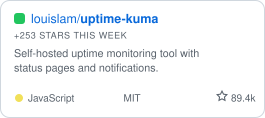
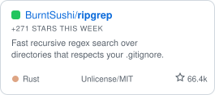

<!-- GENERATED FILE — do not edit README.md directly. -->
<!-- Edit data/tools.json and run scripts/build_readme.py (CI does this nightly). -->

# OSSDrop

**Drop your open-source tool.**
A curated home for open-source tools — by the people who build them.

    

[AI & Coding Agents](#-ai--coding-agents) · [Developer Tools & CLI](#-developer-tools--cli) · [Web & APIs](#-web--apis) · [Data & Databases](#-data--databases) · [DevOps & Self-Hosted](#-devops--self-hosted) · [Files & Sync](#-files--sync) · [Security & Privacy](#-security--privacy) · [Productivity](#-productivity) · [Notes & Knowledge](#-notes--knowledge) · [Communication & Social](#-communication--social) · [Automation & IoT](#-automation--iot) · [Finance & Business](#-finance--business) · [Science & Education](#-science--education) · [Creator / Media](#-creator--media)

## What is OSSDrop?

**OSSDrop is a curated home for open-source tools** — a community-maintained
directory where makers drop their own tool with a single pull request. Every
entry is a real open-source project: public repository, OSI license, honest
one-line description. Star counts, icons, and trending update automatically,
and no placement on this list is paid.

Browse by category below, discuss on [r/OSSDrop](https://www.reddit.com/r/OSSDrop/),
or [drop your tool](CONTRIBUTING.md) — it takes one PR and it's free.

## Trending this week

The biggest star gains among listed tools in the last 7 days — measured, not editorialized.

<a href="https://github.com/riponcm/projectmem"><picture><source media="(prefers-color-scheme: dark)" srcset="assets/cards/riponcm-projectmem-dark.svg"></picture></a>&nbsp;<a href="https://github.com/louislam/uptime-kuma"><picture><source media="(prefers-color-scheme: dark)" srcset="assets/cards/louislam-uptime-kuma-dark.svg"></picture></a>&nbsp;<a href="https://github.com/BurntSushi/ripgrep"><picture><source media="(prefers-color-scheme: dark)" srcset="assets/cards/burntsushi-ripgrep-dark.svg"></picture></a>

## Most starred

The heaviest hitters on the list — recomputed nightly.

<a href="https://github.com/facebook/react"><picture><source media="(prefers-color-scheme: dark)" srcset="assets/cards/facebook-react-dark.svg"></picture></a>&nbsp;<a href="https://github.com/tensorflow/tensorflow"><picture><source media="(prefers-color-scheme: dark)" srcset="assets/cards/tensorflow-tensorflow-dark.svg"></picture></a>&nbsp;<a href="https://github.com/microsoft/vscode"><picture><source media="(prefers-color-scheme: dark)" srcset="assets/cards/microsoft-vscode-dark.svg"></picture></a>

##  AI & Coding Agents

| Tool | What it is | License | Stars | Links |
| --- | --- | --- | --- | --- |
|  **[Ollama](https://ollama.com)** | Run open large language models locally with a simple CLI and API — pull a model and start chatting or building. |  |  | [code](https://github.com/ollama/ollama) |
|  **[Transformers](https://huggingface.co/docs/transformers)** | Hugging Face's library of pretrained models for text, vision, and audio — the standard toolkit for transformer models. |  |  | [code](https://github.com/huggingface/transformers) |
|  **[Grok-1](https://x.ai)** | Open-weights release of xAI's 314B-parameter Grok-1 large language model, with JAX example code. |  |  | [code](https://github.com/xai-org/grok-1) |
|  **[Aider](https://aider.chat)** | AI pair programming in your terminal; edits files in your local git repo and commits as it goes. |  |  | [code](https://github.com/Aider-AI/aider) · [docs](https://aider.chat/docs/) |
|  **[Continue](https://continue.dev)** | Open-source AI coding assistant for VS Code and JetBrains that works with the models you choose. |  |  | [code](https://github.com/continuedev/continue) |
|  **[Gemma](https://ai.google.dev/gemma)** | Google DeepMind's open-weight LLM library, with JAX tooling to run and fine-tune the Gemma models. |  |  | [code](https://github.com/google-deepmind/gemma) |
|  **[RecurrentGemma](https://github.com/google-deepmind/recurrentgemma)** | Google DeepMind's open-weight language model based on the Griffin architecture for fast, memory-efficient inference. |  |  | [code](https://github.com/google-deepmind/recurrentgemma) |
|  **[projectmem](https://projectmem.dev)** | Local-first, event-sourced memory + judgment layer for AI coding agents; warns before repeating a failed fix. |  |  | [code](https://github.com/riponcm/projectmem) · [paper](https://arxiv.org/abs/2606.12329) |

##  Developer Tools & CLI

| Tool | What it is | License | Stars | Links |
| --- | --- | --- | --- | --- |
|  **[VS Code](https://code.visualstudio.com)** | Microsoft's open-source code editor with rich extensions, debugging, and Git — the core of Visual Studio Code. |  |  | [code](https://github.com/microsoft/vscode) |
|  **[Go](https://go.dev)** | Google's open-source programming language for building simple, reliable, and efficient software. |  |  | [code](https://github.com/golang/go) |
|  **[Neovim](https://neovim.io)** | Hyperextensible, Vim-based text editor with a built-in language server client and Lua scripting. |  |  | [code](https://github.com/neovim/neovim) |
|  **[Playwright](https://playwright.dev)** | Microsoft's framework for reliable end-to-end browser testing across Chromium, Firefox, and WebKit. |  |  | [code](https://github.com/microsoft/playwright) |
|  **[MCP Servers](https://modelcontextprotocol.io)** | Reference server implementations for the Model Context Protocol, the open standard connecting AI assistants to tools and data. |  |  | [code](https://github.com/modelcontextprotocol/servers) |
|  **[Zed](https://zed.dev)** | High-performance, multiplayer code editor written in Rust, from the creators of Atom and Tree-sitter. |  |  | [code](https://github.com/zed-industries/zed) |
|  **[fzf](https://junegunn.github.io/fzf/)** | General-purpose command-line fuzzy finder for files, history, and processes; integrates with the shell and Vim. |  |  | [code](https://github.com/junegunn/fzf) |
|  **[lazygit](https://github.com/jesseduffield/lazygit)** | Simple terminal UI for Git commands. |  |  | [code](https://github.com/jesseduffield/lazygit) |
|  **[ripgrep](https://github.com/BurntSushi/ripgrep)** | Fast recursive regex search over directories that respects your .gitignore. |  |  | [code](https://github.com/BurntSushi/ripgrep) |
|  **[bat](https://github.com/sharkdp/bat)** | A cat clone with syntax highlighting and Git integration. |  |  | [code](https://github.com/sharkdp/bat) |
|  **[Starship](https://starship.rs)** | Fast, customizable command-line prompt for any shell — shows git status, versions, and context at a glance. |  |  | [code](https://github.com/starship/starship) |

##  Web & APIs

| Tool | What it is | License | Stars | Links |
| --- | --- | --- | --- | --- |
|  **[React](https://react.dev)** | Meta's JavaScript library for building user interfaces from reusable components. |  |  | [code](https://github.com/facebook/react) |
|  **[Flutter](https://flutter.dev)** | Google's UI toolkit for building natively compiled apps for mobile, web, and desktop from one codebase. |  |  | [code](https://github.com/flutter/flutter) |
|  **[Next.js](https://nextjs.org)** | Vercel's React framework for production — full-stack rendering, routing, and built-in optimizations. |  |  | [code](https://github.com/vercel/next.js) |
|  **[Supabase](https://supabase.com)** | Open-source Firebase alternative: a Postgres database with auth, storage, realtime, and auto-generated APIs. |  |  | [code](https://github.com/supabase/supabase) |
|  **[FastAPI](https://fastapi.tiangolo.com/)** | Modern, high-performance Python web framework for building APIs, with automatic docs and type validation. |  |  | [code](https://github.com/fastapi/fastapi) |
|  **[Bun](https://bun.sh)** | Fast all-in-one JavaScript runtime, bundler, test runner, and package manager, built as a drop-in for Node. |  |  | [code](https://github.com/oven-sh/bun) |
|  **[Hoppscotch](https://hoppscotch.io)** | API development environment in the browser: REST, GraphQL, and realtime clients; self-hostable. |  |  | [code](https://github.com/hoppscotch/hoppscotch) · [docs](https://docs.hoppscotch.io) |
|  **[HTTPie](https://httpie.io)** | User-friendly command-line HTTP client with JSON support and syntax highlighting. |  |  | [code](https://github.com/httpie/cli) · [docs](https://httpie.io/docs/cli) |

##  Data & Databases

| Tool | What it is | License | Stars | Links |
| --- | --- | --- | --- | --- |
|  **[Meilisearch](https://www.meilisearch.com)** | Fast, typo-tolerant search engine with a simple API. | -22C55E?style=flat-square) |  | [code](https://github.com/meilisearch/meilisearch) · [docs](https://www.meilisearch.com/docs) |
|  **[ClickHouse](https://clickhouse.com)** | Column-oriented database management system for real-time analytics over very large datasets. |  |  | [code](https://github.com/ClickHouse/ClickHouse) |
|  **[DuckDB](https://duckdb.org)** | In-process analytical SQL database; runs OLAP queries inside your app or notebook. |  |  | [code](https://github.com/duckdb/duckdb) · [docs](https://duckdb.org/docs/) |
|  **[Qdrant](https://qdrant.tech)** | High-performance vector database and search engine for embeddings — powers semantic search and RAG. |  |  | [code](https://github.com/qdrant/qdrant) |
|  **[Valkey](https://valkey.io)** | High-performance in-memory key-value data store; a community-driven fork of Redis under an open license. |  |  | [code](https://github.com/valkey-io/valkey) |

##  DevOps & Self-Hosted

| Tool | What it is | License | Stars | Links |
| --- | --- | --- | --- | --- |
|  **[Kubernetes](https://kubernetes.io)** | Production-grade container orchestration to automate deployment, scaling, and management of containerized apps. |  |  | [code](https://github.com/kubernetes/kubernetes) |
|  **[Uptime Kuma](https://uptime.kuma.pet)** | Self-hosted uptime monitoring tool with status pages and notifications. |  |  | [code](https://github.com/louislam/uptime-kuma) |
|  **[Grafana](https://grafana.com)** | Open observability platform to query, visualize, and alert on metrics, logs, and traces. |  |  | [code](https://github.com/grafana/grafana) |
|  **[Caddy](https://caddyserver.com)** | Web server and reverse proxy with automatic HTTPS by default, configured in a simple, readable file. |  |  | [code](https://github.com/caddyserver/caddy) |
|  **[Coolify](https://coolify.io)** | Self-hostable platform to deploy apps, databases, and static sites; an open alternative to Heroku and Netlify. |  |  | [code](https://github.com/coollabsio/coolify) |
|  **[Portainer](https://www.portainer.io)** | Web UI to manage Docker, Swarm, and Kubernetes — deploy, monitor, and control containers from a browser. |  |  | [code](https://github.com/portainer/portainer) |
|  **[OpenTofu](https://opentofu.org)** | Infrastructure-as-code tool to provision cloud and on-prem resources declaratively; community-driven fork of Terraform. |  |  | [code](https://github.com/opentofu/opentofu) |

##  Files & Sync

| Tool | What it is | License | Stars | Links |
| --- | --- | --- | --- | --- |
|  **[Syncthing](https://syncthing.net)** | Continuous, peer-to-peer file synchronization between your devices — private, encrypted, no cloud required. |  |  | [code](https://github.com/syncthing/syncthing) |
|  **[rclone](https://rclone.org)** | Command-line program to sync, copy, and manage files across dozens of cloud storage providers. |  |  | [code](https://github.com/rclone/rclone) |

##  Security & Privacy

| Tool | What it is | License | Stars | Links |
| --- | --- | --- | --- | --- |
|  **[Vaultwarden](https://github.com/dani-garcia/vaultwarden)** | Lightweight, self-hostable server compatible with Bitwarden clients — run your own password manager. |  |  | [code](https://github.com/dani-garcia/vaultwarden) |
|  **[KeePassXC](https://keepassxc.org)** | Cross-platform, offline password manager; community continuation of KeePass. |  |  | [code](https://github.com/keepassxreboot/keepassxc) · [docs](https://keepassxc.org/docs/) |
|  **[Cryptomator](https://cryptomator.org)** | Client-side, password-based encryption for your cloud files, across desktop and mobile. |  |  | [code](https://github.com/cryptomator/cryptomator) |

##  Productivity

| Tool | What it is | License | Stars | Links |
| --- | --- | --- | --- | --- |
|  **[PowerToys](https://learn.microsoft.com/windows/powertoys/)** | Microsoft's set of power-user utilities for Windows: window management, bulk rename, color picker, and more. |  |  | [code](https://github.com/microsoft/PowerToys) |
|  **[Excalidraw](https://excalidraw.com)** | Virtual whiteboard for sketching hand-drawn-style diagrams and wireframes, with live collaboration. |  |  | [code](https://github.com/excalidraw/excalidraw) |
|  **[AppFlowy](https://appflowy.io)** | Open-source Notion alternative for notes, docs, and project boards — local-first and self-hostable. |  |  | [code](https://github.com/AppFlowy-IO/AppFlowy) |
|  **[GemType](https://gemtype.matily.org)** | Free, open-source Grammarly alternative: AI grammar and rewrite for Chrome and Safari. |  |  | [code](https://github.com/riponcm/GemType) |

##  Notes & Knowledge

| Tool | What it is | License | Stars | Links |
| --- | --- | --- | --- | --- |
|  **[Joplin](https://joplinapp.org)** | Privacy-focused, open-source note-taking and to-do app with end-to-end encrypted sync across devices. |  |  | [code](https://github.com/laurent22/joplin) |
|  **[Logseq](https://logseq.com)** | Privacy-first, local-first knowledge base for networked notes and outlines over plain Markdown files. |  |  | [code](https://github.com/logseq/logseq) |

##  Communication & Social

| Tool | What it is | License | Stars | Links |
| --- | --- | --- | --- | --- |
|  **[Jitsi Meet](https://jitsi.org)** | Encrypted, self-hostable video conferencing — start or join a meeting from the browser, no account needed. |  |  | [code](https://github.com/jitsi/jitsi-meet) |

##  Automation & IoT

| Tool | What it is | License | Stars | Links |
| --- | --- | --- | --- | --- |
|  **[Home Assistant](https://www.home-assistant.io)** | Open-source home automation that puts local control and privacy first, integrating thousands of devices. |  |  | [code](https://github.com/home-assistant/core) |
|  **[Node-RED](https://nodered.org)** | Low-code, flow-based tool for wiring together APIs, devices, and services — visual automation in the browser. |  |  | [code](https://github.com/node-red/node-red) |

##  Finance & Business

| Tool | What it is | License | Stars | Links |
| --- | --- | --- | --- | --- |
|  **[Firefly III](https://firefly-iii.org)** | Self-hosted personal finance manager to track accounts, budgets, and bills, with reports and rules. |  |  | [code](https://github.com/firefly-iii/firefly-iii) |

##  Science & Education

| Tool | What it is | License | Stars | Links |
| --- | --- | --- | --- | --- |
|  **[TensorFlow](https://www.tensorflow.org)** | Google's end-to-end open-source platform for machine learning, from research to production. |  |  | [code](https://github.com/tensorflow/tensorflow) |
|  **[PyTorch](https://pytorch.org)** | Meta's Python-first deep-learning framework with strong GPU acceleration and dynamic graphs. |  |  | [code](https://github.com/pytorch/pytorch) |
|  **[JupyterLab](https://jupyter.org)** | Web-based interactive development environment for notebooks, code, and data across many languages. |  |  | [code](https://github.com/jupyterlab/jupyterlab) |
|  **[QGIS](https://qgis.org)** | Free, cross-platform desktop GIS for creating, editing, analysing, and publishing geospatial data. |  |  | [code](https://github.com/qgis/QGIS) |
|  **[AcadGIS](https://acadgis.com)** | Publication-ready study-area maps, choropleths, and locator insets for research papers, in Python. |  |  | [code](https://github.com/riponcm/AcadGIS) |

##  Creator / Media

| Tool | What it is | License | Stars | Links |
| --- | --- | --- | --- | --- |
|  **[Whisper](https://github.com/openai/whisper)** | OpenAI's robust multilingual speech-to-text model for transcription and translation. |  |  | [code](https://github.com/openai/whisper) |
|  **[OBS Studio](https://obsproject.com)** | Free, open-source software for live streaming and screen recording. |  |  | [code](https://github.com/obsproject/obs-studio) · [docs](https://docs.obsproject.com) |
|  **[VibeVoice](https://microsoft.github.io/VibeVoice/)** | Microsoft's open-source frontier text-to-speech model for long-form, multi-speaker conversational audio. |  |  | [code](https://github.com/microsoft/VibeVoice) |
|  **[Blender](https://www.blender.org)** | Free 3D creation suite: modeling, sculpting, animation, simulation, rendering, and video editing. |  |  | [code](https://github.com/blender/blender) |
|  **[ACE-Step](https://ace-step.github.io/)** | An open-source foundation model for music generation, built for fast, controllable, full-length track synthesis. |  |  | [code](https://github.com/ace-step/ACE-Step) |

---

## Drop yours

Built something open source? Add one entry to [`data/tools.json`](data/tools.json)
and open a PR — see **[CONTRIBUTING.md](CONTRIBUTING.md)**. One tool per PR.
Stars, icons, and trending are computed automatically; descriptions stay honest.

## Frequently asked questions

**What is OSSDrop?**
OSSDrop is a curated, community-maintained list of open-source tools, organized
into categories spanning AI and coding agents, developer tools and CLI utilities,
web and APIs, data and databases, DevOps and self-hosted software, files and sync,
security and privacy, productivity, notes and knowledge, communication and social,
automation and IoT, finance and business, science and education, and creator and
media tools.

**How do I add my open-source tool to the list?**
Fork this repository, add one JSON object to `data/tools.json`, and open a pull
request. Requirements: a public repository and an OSI-approved license. See
[CONTRIBUTING.md](CONTRIBUTING.md).

**Is listing free? Can rankings be bought?**
Listing is free and rankings cannot be bought. Tables are sorted by live GitHub
star count and “Trending this week” is computed from daily star snapshots.
The one pinned showcase card is always labeled as pinned.

**Where else does OSSDrop live?**
On Reddit at [r/OSSDrop](https://www.reddit.com/r/OSSDrop/) for discussion, and
at [ossdrop.com](https://ossdrop.com) (coming soon). The GitHub organization is
[github.com/OSSDrop](https://github.com/OSSDrop).

**Can I reuse this list's data?**
Yes — the list content is public domain ([CC0-1.0](LICENSE)), and
[`data/tools.json`](data/tools.json) is the machine-readable source of truth.
Each linked tool keeps its own license.

Star counts and licenses render live via shields.io; trending is computed
from daily snapshots in `data/stars.json`.
